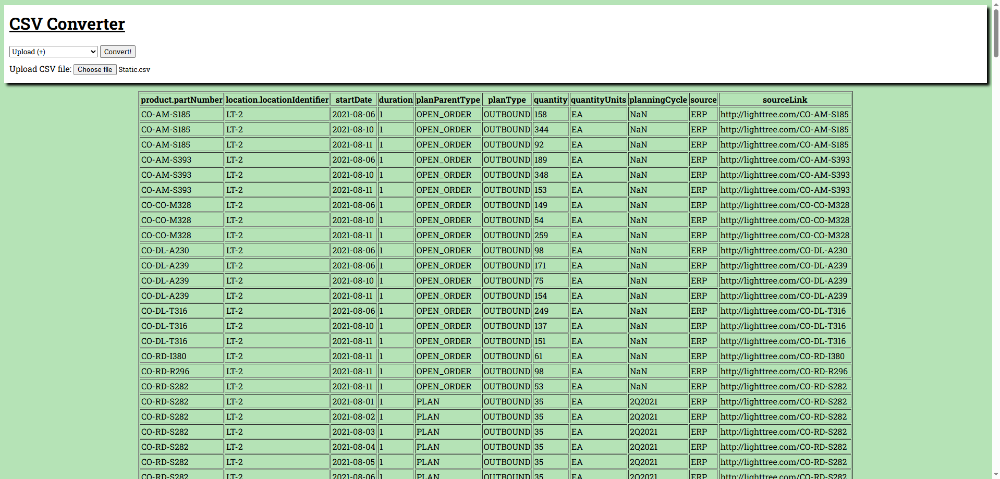

# flask-csv-converter
 Converting Comma-Separated-Values (CSV) files into HTML tables using the Flask framework. 
 

## Local Installation:

Using the following Bash commands, you can install the app and it run it at http://localhost:8000 

```shell
# 1. clone the repo:
$ git clone https://github.com/jacobrussell-eng/flask-csv-converter.git
$ cd flask-csv-converter

# 2. install Python packages:
$ pip install -r requirements.txt

# 3. run:
$ python app.py
```

## Resources:
Sample CSV Files - [datablist on GitHub](https://github.com/datablist/sample-csv-files)\
Sample CSV Files - [IBM](https://www.ibm.com/docs/en/scis?topic=samples-sample-csv-files)\
Character Encoding types - [StackOverflow](https://stackoverflow.com/questions/66763798/type-of-encoding-to-read-csv-files-in-pandas)\
Roboto Slab font - [Google Fonts](https://fonts.google.com/specimen/Roboto+Slab)\
Background Colour - [Random Hex Generator](https://jacobrussell-eng.github.io/Random-Hex-Generator/)